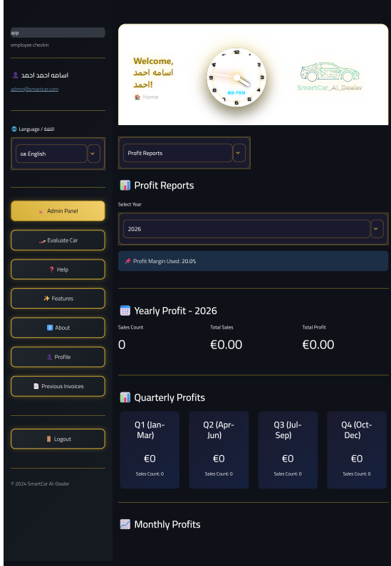

# 🏎️ SmartCar AI Dealer

<div align="center">


**نظام متكامل لتجارة السيارات بالذكاء الاصطناعي**

[العربية](#العربية) | [Deutsch](#deutsch) | [English](#english)

</div>

---

## 🌟 المميزات الرئيسية

### 🤖 الذكاء الاصطناعي
- **تحليل صور السيارات** - التعرف التلقائي على الماركة والموديل واللون
- **تقييم الأسعار** - تقدير سعر السيارة بناءً على الحالة والمواصفات
- **تحليل الحالة** - فحص حالة السيارة من الصور

### 💼 إدارة الأعمال
- **إدارة العملاء** - تسجيل بيانات العملاء والهويات
- **نظام التقسيط** - خطط دفع مرنة مع تتبع الأقساط
- **العقود الرقمية** - إنشاء وإدارة عقود البيع

### 👥 الموارد البشرية (HR)
- **إدارة الموظفين** - بيانات كاملة للموظفين
- **كشوف الرواتب** - إنشاء PDF احترافي مع الضرائب الألمانية
- **إدارة الإجازات** - تتبع الإجازات السنوية والمرضية

### 📊 التقارير والإحصائيات
- **تقارير الأرباح** - شهرية، ربع سنوية، وسنوية
- **لوحة تحكم** - إحصائيات شاملة للمبيعات
- **تصدير البيانات** - تصدير التقارير بصيغ متعددة

### 🌍 تعدد اللغات
- 🇸🇦 العربية (RTL)
- 🇩🇪 الألمانية
- 🇬🇧 الإنجليزية

---

## 🛠 التقنيات المستخدمة

| التقنية | الاستخدام |
|---------|----------|
| **Python 3.10+** | لغة البرمجة الأساسية |
| **Streamlit** | واجهة المستخدم التفاعلية |
| **SQLite** | قاعدة البيانات |
| **Groq Vision AI** | تحليل صور السيارات |
| **FPDF2** | إنشاء ملفات PDF |
| **Bcrypt** | تشفير كلمات المرور |
| **Pandas** | معالجة البيانات |

---

## 🚀 التثبيت والتشغيل

### 1. استنساخ المشروع
```bash
git clone https://github.com/Osamaamhmad67/SmartCar_AI_Dealer.git
cd SmartCar_AI_Dealer
```

### 2. إنشاء بيئة افتراضية
```bash
python -m venv venv
# Windows
venv\Scripts\activate
# Linux/Mac
source venv/bin/activate
```

### 3. تثبيت المتطلبات
```bash
pip install -r requirements.txt
```

### 4. إعداد ملف البيئة
```bash
# أنشئ ملف .env
cp .env.example .env
# أضف مفاتيح API الخاصة بك
```

### 5. تشغيل التطبيق
```bash
streamlit run app.py
```

---

## 📁 هيكل المشروع

```
SmartCar_AI_Dealer/
├── app.py              # التطبيق الرئيسي
├── auth.py             # نظام المصادقة
├── db_manager.py       # إدارة قاعدة البيانات
├── config.py           # الإعدادات
├── locales/            # ملفات الترجمة
│   ├── ar.json         # العربية
│   ├── de.json         # الألمانية
│   └── en.json         # الإنجليزية
├── utils/              # الأدوات المساعدة
│   ├── invoice_generator.py
│   ├── predictor.py
│   └── i18n.py
└── static/             # الملفات الثابتة
```

---

## 📸 لقطات الشاشة

<div align="center">

| لوحة التحكم | تحليل السيارة | تقارير الأرباح |
|-------------|---------------|----------------|
|  |  |  |

</div>

---

## 🔒 الأمان

- ✅ تشفير كلمات المرور بـ Bcrypt
- ✅ حماية من هجمات القوة الغاشمة
- ✅ تأكيد كلمة المرور للعمليات الحساسة
- ✅ إدارة الجلسات الآمنة

---

## 📝 الرخصة

هذا المشروع مرخص تحت رخصة MIT - انظر ملف [LICENSE](LICENSE) للتفاصيل.

---

## 👤 المطور

**Osama Ahmad**

- GitHub: [@Osamaamhmad67](https://github.com/Osamaamhmad67)
- LinkedIn: [Osama Ahmad](https://www.linkedin.com/in/osama-ahmad-758447371/)

---

## 🤝 المساهمة

المساهمات مرحب بها! يرجى فتح Issue أو Pull Request.

---

<div align="center">

⭐ **إذا أعجبك المشروع، لا تنسَ إضافة نجمة!** ⭐

</div>