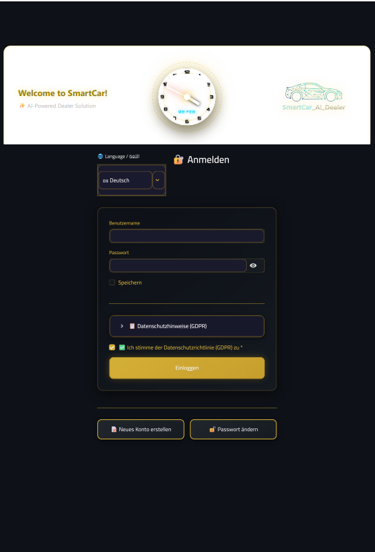
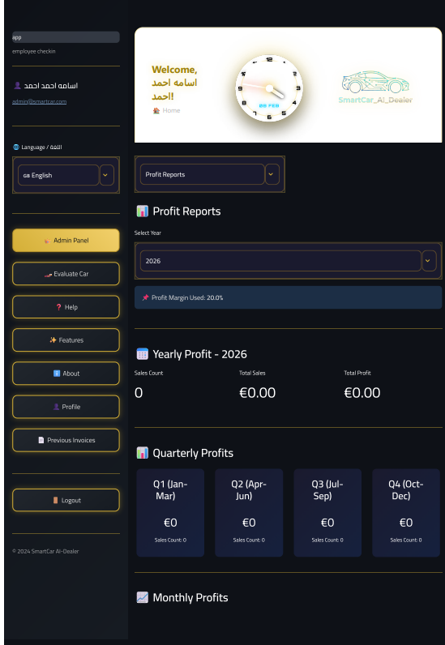

# 🏎️ SmartCar AI Dealer

<div align="center">


**نظام متكامل لتجارة السيارات بالذكاء الاصطناعي**

[العربية](#العربية) | [Deutsch](#deutsch) | [English](#english)

</div>

---

## 🌟 المميزات الرئيسية

### 🤖 الذكاء الاصطناعي (AI)
- **تحليل صور السيارات** - التعرف التلقائي على الماركة والموديل واللون والحالة عبر Groq Vision AI
- **تقييم الأسعار الذكي** - تقدير سعر السيارة بناءً على 20+ عامل (الحالة، المسافة، TÜV، التجهيزات...)
- **ملء تلقائي لمواصفات المحرك** - استرجاع Hubraum (CC) و Leistung (PS) تلقائياً من قاعدة بيانات 33+ ماركة
- **مسح ضوئي OCR** - قراءة بطاقة الهوية ورخصة القيادة تلقائياً

### 💼 إدارة الأعمال
- **إدارة العملاء** - تسجيل بيانات العملاء الكاملة (هوية، رخصة، عنوان)
- **نظام التقسيط المتقدم** - خطط دفع مرنة مع فوائد، غرامات تأخير، وتتبع الأقساط
- **العقود الرقمية (PDF)** - إنشاء عقود بيع احترافية ثلاثية اللغة
- **نظام فوترة متكامل** - فواتير أقساط مع QR Code وسلسلة تحقق
- **التحقق من الدفع** - مسح إيصالات الدفع والتحقق بالذكاء الاصطناعي

### 👥 الموارد البشرية (HR)
- **إدارة الموظفين** - بيانات كاملة مع عمولات مبيعات
- **كشوف الرواتب** - إنشاء PDF احترافي مع الضرائب الألمانية (Lohnsteuer, Sozialversicherung)
- **نظام الحضور QR** - تسجيل حضور وانصراف عبر رمز QR
- **إدارة الإجازات** - تتبع الإجازات السنوية والمرضية

### 📊 التقارير والإحصائيات
- **تقارير الأرباح** - شهرية، ربع سنوية، وسنوية مع الرسوم البيانية
- **لوحة تحكم إدارية** - إحصائيات شاملة للمبيعات والمعاملات
- **تصدير البيانات** - تصدير التقارير بصيغ متعددة

### 🌍 تعدد اللغات
- 🇸🇦 العربية (RTL support)
- 🇩🇪 الألمانية (Deutsch)
- 🇬🇧 الإنجليزية (English)

---

## 🛠 التقنيات المستخدمة

| التقنية | الاستخدام |
|---------|----------|
| **Python 3.10+** | لغة البرمجة الأساسية |
| **Streamlit** | واجهة المستخدم التفاعلية |
| **SQLite** | قاعدة البيانات |
| **Groq Vision AI** | تحليل صور السيارات |
| **FPDF2** | إنشاء ملفات PDF |
| **Bcrypt** | تشفير كلمات المرور |
| **Pandas** | معالجة البيانات |

---

## 🚀 التثبيت والتشغيل

### 1. استنساخ المشروع
```bash
git clone https://github.com/Osamaamhmad67/SmartCar_AI_Dealer.git
cd SmartCar_AI_Dealer
```

### 2. إنشاء بيئة افتراضية
```bash
python -m venv venv
# Windows
venv\Scripts\activate
# Linux/Mac
source venv/bin/activate
```

### 3. تثبيت المتطلبات
```bash
pip install -r requirements.txt
```

### 4. إعداد ملف البيئة
```bash
# أنشئ ملف .env
cp .env.example .env
# أضف مفاتيح API الخاصة بك
```

### 5. تشغيل التطبيق
```bash
streamlit run app.py
```

---

## 📁 هيكل المشروع

```
SmartCar_AI_Dealer/
├── app.py                  # التطبيق الرئيسي
├── auth.py                 # نظام المصادقة
├── db_manager.py           # إدارة قاعدة البيانات
├── config.py               # الإعدادات المركزية
├── groq_client.py          # عميل Groq AI Vision
├── groq_base.py            # الفئة الأساسية لـ Groq
├── pages_app/              # صفحات التطبيق
│   ├── admin_page.py       # لوحة تحكم الأدمن
│   ├── predict_pages.py    # تقييم السعر بالـ AI
│   ├── checkout_pages.py   # الدفع والعقود
│   ├── home_page.py        # الصفحة الرئيسية
│   ├── profile_pages.py    # ملف العميل
│   ├── invoices_page.py    # إدارة الفواتير
│   └── auth_pages.py       # تسجيل الدخول
├── components/             # مكونات واجهة المستخدم
├── utils/                  # الأدوات المساعدة
│   ├── invoice_generator.py    # مولد العقود PDF
│   ├── installment_invoice.py  # فواتير الأقساط
│   ├── predictor.py            # محرك التسعير
│   ├── i18n.py                 # نظام الترجمة
│   ├── ocr_scanner.py          # ماسح الوثائق
│   └── payment_processor.py    # معالج الدفع
├── data/                   # بيانات مرجعية
│   └── car_specs.json      # مواصفات 33+ ماركة سيارة
├── locales/                # ملفات الترجمة
│   ├── ar.json / de.json / en.json
├── scripts/                # سكربتات الإدارة
├── fonts/                  # خطوط Cairo للـ PDF
└── pages/                  # صفحات Streamlit المستقلة
    └── employee_checkin.py # حضور الموظفين QR
```

---

## 📸 Screenshots

<div align="center">

### 🏠 Home Page / الصفحة الرئيسية


### 🤖 AI Car Analysis / تحليل السيارة بالذكاء الاصطناعي


</div>

---

## 🔒 الأمان

- ✅ تشفير كلمات المرور بـ Bcrypt
- ✅ حماية من هجمات القوة الغاشمة
- ✅ تأكيد كلمة المرور للعمليات الحساسة
- ✅ إدارة الجلسات الآمنة

---

## 📝 الرخصة

هذا المشروع مرخص تحت رخصة MIT - انظر ملف [LICENSE](LICENSE) للتفاصيل.

---

## 👤 المطور

**Osama Ahmad**

- GitHub: [@Osamaamhmad67](https://github.com/Osamaamhmad67)
- LinkedIn: [Osama Ahmad](https://www.linkedin.com/in/osama-ahmad-758447371/)

---

## 🤝 المساهمة

المساهمات مرحب بها! يرجى فتح Issue أو Pull Request.

---

<div align="center">

⭐ **إذا أعجبك المشروع، لا تنسَ إضافة نجمة!** ⭐

</div>