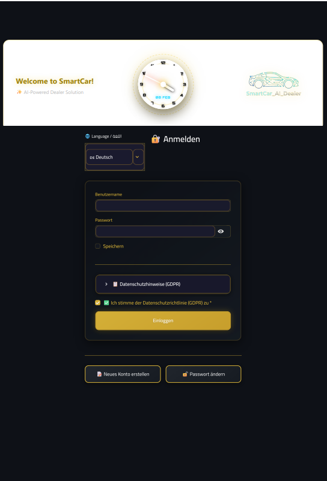
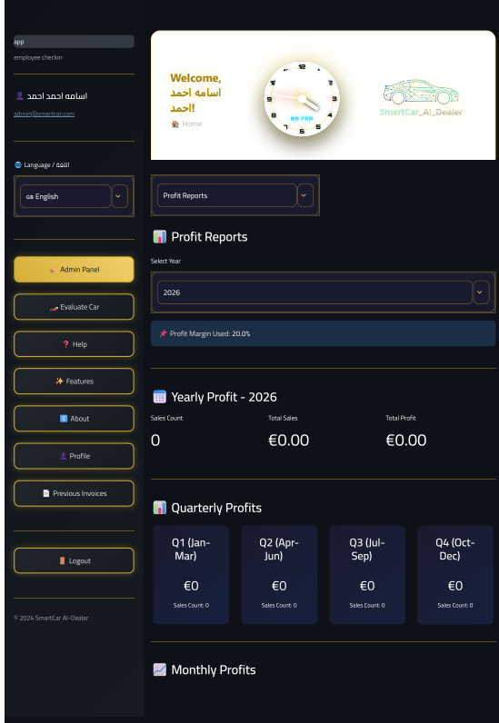

# 🏎️ SmartCar AI Dealer

<div align="center">


**نظام متكامل لتجارة السيارات بالذكاء الاصطناعي**

[العربية](#العربية) | [Deutsch](#deutsch) | [English](#english)

</div>

---

## 🌟 المميزات الرئيسية

### 🤖 الذكاء الاصطناعي (AI)
- **تحليل صور السيارات** - التعرف التلقائي على الماركة والموديل واللون والحالة عبر Groq Vision AI
- **تقييم الأسعار الذكي** - تقدير سعر السيارة بناءً على 30+ عامل مع خوارزمية تخميد متقدمة
- **ملء تلقائي لمواصفات المحرك** - استرجاع Hubraum (CC) و Leistung (PS) تلقائياً من قاعدة بيانات 33+ ماركة
- **مسح ضوئي OCR** - قراءة بطاقة الهوية ورخصة القيادة تلقائياً

### 💰 محرك التسعير المتقدم (Advanced Pricing Engine)
- **30+ عامل مؤثر** - الحالة، المسافة، العمر، الماركة، الوقود، ناقل الحركة، الانبعاثات، الضمان...
- **35 تجهيزة** - من المقاعد الجلدية إلى نظام Burmester Sound و 360° Camera
- **أسعار واقعية** - معايرة على متوسط السوق الألماني المستعمل (DAT/Schwacke)
- **تخميد العوامل** - خوارزمية تمنع التكديس المبالغ فيه للمعاملات المتعددة
- **40+ ماركة مدعومة** - من Dacia إلى Rolls-Royce مع معاملات مخصصة لكل ماركة

### 💼 إدارة الأعمال
- **إدارة العملاء** - تسجيل بيانات العملاء الكاملة (هوية، رخصة، عنوان)
- **نظام التقسيط المتقدم** - خطط دفع مرنة مع فوائد، غرامات تأخير، وتتبع الأقساط
- **العقود الرقمية (PDF)** - عقود بيع احترافية ثلاثية اللغة مع صورة السيارة وجميع المواصفات
- **نظام فوترة متكامل** - فواتير أقساط مع QR Code وسلسلة تحقق
- **التحقق من الدفع** - مسح إيصالات الدفع والتحقق بالذكاء الاصطناعي

### 📄 العقود والتقارير
- **صورة السيارة في العقد** - عرض احترافي مع إطار وتعليق تلقائي
- **22+ حقل مواصفات** - نوع، ماركة، موديل، TÜV، مقاعد، مالكين سابقين، صيانة...
- **35 تجهيزة مفصّلة** - تظهر كقائمة في العقد مع ترجمة ثلاثية اللغة
- **تصدير DATEV** - تكامل مع نظام المحاسبة الألماني

### 👥 الموارد البشرية (HR)
- **إدارة الموظفين** - بيانات كاملة مع عمولات مبيعات
- **كشوف الرواتب** - إنشاء PDF احترافي مع الضرائب الألمانية (Lohnsteuer, Sozialversicherung)
- **نظام الحضور QR** - تسجيل حضور وانصراف عبر رمز QR
- **إدارة الإجازات** - تتبع الإجازات السنوية والمرضية
- **لوحة الموظف** - إحصائيات الأداء والمبيعات الشخصية

### 📊 التقارير والإحصائيات
- **تقارير الأرباح** - شهرية، ربع سنوية، وسنوية مع الرسوم البيانية
- **لوحة تحكم إدارية** - إحصائيات شاملة للمبيعات والمعاملات
- **خريطة حرارية للمبيعات** - تحليل بصري للمبيعات حسب الوقت
- **تصدير البيانات** - تصدير التقارير بصيغ متعددة (PDF, CSV)

### 🌍 تعدد اللغات (478+ مفتاح ترجمة)
- 🇸🇦 العربية (RTL support)
- 🇩🇪 الألمانية (Deutsch)
- 🇬🇧 الإنجليزية (English)

---

## 🛠 التقنيات المستخدمة

| التقنية | الاستخدام |
|---------|----------|
| **Python 3.10+** | لغة البرمجة الأساسية |
| **Streamlit** | واجهة المستخدم التفاعلية |
| **SQLite** | قاعدة البيانات (27 عمود للمعاملات) |
| **Groq Vision AI** | تحليل صور السيارات (Llama 4 Scout) |
| **FPDF2** | إنشاء ملفات PDF (عقود + فواتير) |
| **Bcrypt** | تشفير كلمات المرور |
| **Pandas** | معالجة البيانات والتقارير |

---

## 🚀 التثبيت والتشغيل

### 1. استنساخ المشروع
```bash
git clone https://github.com/Osamaamhmad67/SmartCar_AI_Dealer.git
cd SmartCar_AI_Dealer
```

### 2. إنشاء بيئة افتراضية
```bash
python -m venv venv
# Windows
venv\Scripts\activate
# Linux/Mac
source venv/bin/activate
```

### 3. تثبيت المتطلبات
```bash
pip install -r requirements.txt
```

### 4. إعداد ملف البيئة
```bash
cp .env.example .env
# أضف مفتاح GROQ_API_KEY الخاص بك
```

### 5. تشغيل التطبيق
```bash
streamlit run app.py
```

---

## 📁 هيكل المشروع

```
SmartCar_AI_Dealer/
├── app.py                  # التطبيق الرئيسي
├── auth.py                 # نظام المصادقة
├── db_manager.py           # إدارة قاعدة البيانات
├── config.py               # الإعدادات المركزية + محرك التسعير
├── groq_client.py          # عميل Groq AI Vision
├── pages_app/              # صفحات التطبيق
│   ├── admin_page.py       # لوحة تحكم الأدمن
│   ├── predict_pages.py    # تقييم السعر بالـ AI (35 تجهيزة)
│   ├── checkout_pages.py   # الدفع والعقود
│   ├── home_page.py        # الصفحة الرئيسية
│   ├── profile_pages.py    # ملف العميل
│   ├── showcase_page.py    # معرض السيارات
│   ├── crm_page.py         # إدارة علاقات العملاء
│   └── employee_dashboard_page.py  # لوحة الموظف
├── components/             # مكونات واجهة المستخدم
│   ├── finance_calculator.py   # حاسبة التمويل
│   ├── car_comparison.py       # مقارنة السيارات
│   ├── sales_heatmap.py        # خريطة حرارية
│   └── notifications_bell.py   # جرس الإشعارات
├── utils/                  # الأدوات المساعدة
│   ├── invoice_generator.py    # مولد العقود والفواتير PDF
│   ├── predictor.py            # محرك التسعير (30+ عامل)
│   ├── profit_analyzer.py      # تحليل الأرباح
│   ├── datev_export.py         # تصدير DATEV
│   ├── csv_importer.py         # استيراد بيانات
│   └── ocr_scanner.py          # ماسح الوثائق
├── data/
│   ├── car_specs.json      # مواصفات 33+ ماركة سيارة
│   └── images/             # صور السيارات المقيّمة
├── locales/                # ملفات الترجمة (478 مفتاح)
│   ├── ar.json / de.json / en.json
├── fonts/                  # خطوط Cairo للـ PDF العربي
└── pages/
    └── employee_checkin.py # حضور الموظفين QR
```

---

## 📸 Screenshots

<div align="center">

### 🏠 Home Page / الصفحة الرئيسية


### 🤖 AI Car Analysis / تحليل السيارة بالذكاء الاصطناعي


</div>

---

## 🔒 الأمان

- ✅ تشفير كلمات المرور بـ Bcrypt
- ✅ حماية من هجمات القوة الغاشمة
- ✅ تأكيد كلمة المرور للعمليات الحساسة
- ✅ إدارة الجلسات الآمنة

---

## 📝 الرخصة

هذا المشروع مرخص تحت رخصة MIT - انظر ملف [LICENSE](LICENSE) للتفاصيل.

---

## 👤 المطور

**Osama Ahmad**

- GitHub: [@Osamaamhmad67](https://github.com/Osamaamhmad67)
- LinkedIn: [Osama Ahmad](https://www.linkedin.com/in/osama-ahmad-758447371/)

---

## 🤝 المساهمة

المساهمات مرحب بها! يرجى فتح Issue أو Pull Request.

---

<div align="center">

⭐ **إذا أعجبك المشروع، لا تنسَ إضافة نجمة!** ⭐

</div>